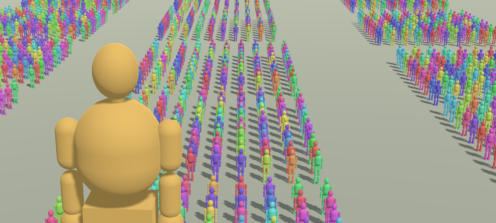

# CineForge 白模预演

CineForge 是一款开源的 Windows 桌面端 3D 预演工具，帮助导演、分镜师、动画师和内容创作者在拍摄或制作前快速搭建场景、设计镜头、检查节奏，并输出可分享的预演画面与视频。



## 它能做什么

| 模块 | 能力 |
| --- | --- |
| 场景搭建 | 添加白模人物、基础几何体、建筑、道路、家具、载具与自然物件 |
| 物体编辑 | 选择、多选、复制、分组、重命名、显隐、颜色和三轴变换 |
| 人物与调度 | 多种身体类型、姿势预设、群众阵列和物体动画 |
| 虚拟相机 | 自由飞行、焦距、画幅、透视视图和构图辅助 |
| 镜头设计 | 预制运镜、相机关键帧、物体关键帧、自动机位点和手持效果 |
| 时间线 | 多段落编排、轨道、播放头、循环播放和段落连播 |
| 输出 | JSON 工程、PNG 静帧和 H.264 MP4 视频 |

## 获取与启动

### Windows 运行包

1. 打开 [Releases](../../releases/latest)。
2. 下载最新的 Windows ZIP 包并完整解压。
3. 双击 `START.bat` 启动应用。

Windows 可能会因为程序尚未签名而显示 SmartScreen 提示。请只从本仓库的 Release 页面下载文件。

### 从源码运行

准备：

- Godot Engine `4.7.0`
- Windows 10 或 Windows 11 x64
- FFmpeg，仅导出 MP4 时需要

```powershell
git clone https://github.com/Touka404x/cineforge-previz.git
cd cineforge-previz
.\RUN_SOURCE.bat
```

`RUN_SOURCE.bat` 会在已安装的 Godot 4.7 中打开 `source/project.godot`。也可以直接用 Godot 打开该工程并运行主场景。

## 基本工作流

1. 在“布景”模式添加人物、模型或基础几何体，调整位置、旋转、缩放和颜色。
2. 切换到“拍摄”模式，设置构图、焦距、画幅和环境。
3. 为相机和物体记录关键帧，或在镜头库中预览并套用预制运镜。
4. 在时间线中检查段落衔接、动作和节奏。
5. 保存 JSON 工程，导出 PNG 静帧或 MP4 视频。

常用快捷键：`W/A/S/D` 移动相机，右键拖动转向，`K` 记录相机关键帧，`J` 记录物体关键帧，`Space` 播放或暂停，`Ctrl+S` 保存工程。

## 分享你的预演

CineForge 是桌面应用，不提供项目上传、网页托管或公开链接功能。完成镜头后，可导出 PNG 或 MP4，再通过你自己的视频平台、网盘或协作工具分享给团队成员。

## 工程与输出

- **工程文件**：JSON，保存场景、段落、关键帧、相机与环境设置。
- **静帧输出**：PNG，不包含编辑器界面。
- **视频输出**：1920x1080 H.264 MP4；导出时由本地 Godot 渲染和 FFmpeg 编码完成。

## 项目结构

```text
source/                 Godot 工程、脚本、模型、缩略图和预览素材
docs/                   架构与数据说明
third_party/            第三方许可证与声明
RUN_SOURCE.bat          源码工程启动入口
```

代码结构和数据流见 [架构文档](docs/ARCHITECTURE.md)，数据处理方式见 [数据与网络说明](docs/PRIVACY_AND_NETWORK.md)。

## 参与项目

- 使用问题或功能建议请通过 GitHub Issues 提交，详情见 [支持说明](SUPPORT.md)。
- 愿意参与开发时，请阅读 [贡献指南](CONTRIBUTING.md)。
- 安全问题请遵循 [安全策略](SECURITY.md) 私下报告。

## 许可证

本项目业务代码按 [GNU GPL v3](LICENSE) 发布。Godot、FFmpeg、字体、模型和图片等组件适用各自的许可条款，详见 [第三方声明](THIRD_PARTY_NOTICES.md)。
