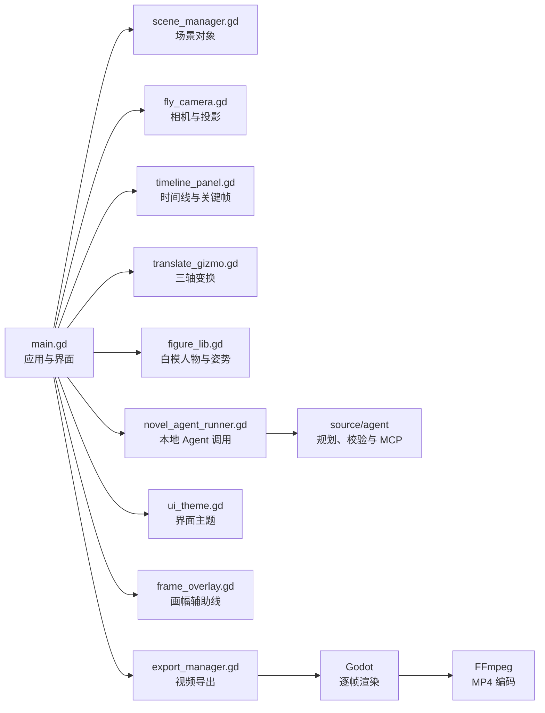

# 项目架构

本文面向希望了解或扩展本项目的使用者。应用基于 Godot 4.7 构建，主场景由 `main.gd` 在运行时组织界面、三维场景、时间线与导出流程。

## 核心模块

| 模块 | 职责 |
| --- | --- |
| `main.gd` | 应用生命周期、界面、段落、关键帧、保存、加载与导出编排 |
| `scene_manager.gd` | 场景对象创建、选择、分组、复制、颜色与 JSON 序列化 |
| `fly_camera.gd` | 相机输入、预设视角、焦距、投影和坐标转换 |
| `timeline_panel.gd` | 时间刻度、轨道、关键帧和播放头交互 |
| `translate_gizmo.gd` | 移动、旋转、缩放与命中测试 |
| `figure_lib.gd` | 程序化白模人物、身体比例与姿势 |
| `export_manager.gd` | 调用本地渲染进程与 FFmpeg 生成 MP4 |
| `ui_theme.gd` | 字体、颜色、控件和菜单样式 |
| `frame_overlay.gd` | 拍摄模式的画幅边界与安全区 |
| `novel_agent_runner.gd` | 调用本地 Python Agent，读取已校验的场景计划 |
| `source/agent/previz_agent/` | 小说分场、资产白名单、确定性校验、可选模型复核和 stdio MCP 服务 |

## 数据流

1. 启动后读取 `models_index.json`，建立素材分类与场景环境。
2. 用户操作由 `main.gd` 分发给场景、相机、时间线和变换工具。
3. 相机与物体关键帧按段落保存；播放时按时间插值应用到场景。
4. 工程保存为用户选择的 JSON 文件，加载时根据模型索引重新创建对象。
5. 导出视频时，Godot 先生成本地临时 AVI，再由 FFmpeg 编码为 MP4。
6. AI 预演将小说文本交给本地 Agent；Agent 返回受限 JSON，Godot 只在用户确认后创建场景组、段落、环境和相机关键帧。

## 资源目录

- `source/models_index.json`：模型分类、文件路径、缩略图和默认缩放。
- `source/models/`：建筑、家具、住宅、道路、自然、载具等 GLB 模型。
- `source/thumbs/`：模型选择器缩略图。
- `source/previews/`：预制运镜动画预览。
- `source/fonts/`：界面字体。
