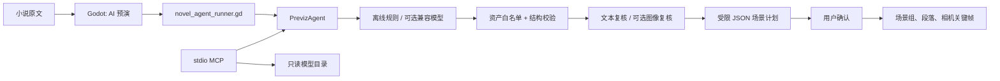

# MCP 与 Agent 手册

## 目标

本项目的 Agent 把 1000-2000 字中文小说原文变为可检查、可导入的白模预演计划。它不是给模型开放一台电脑，而是将模型输出限制为一份 JSON 场景清单：场景范围、环境、相机预设以及只能从本地目录中选择的模型/人物/基础体。

整体设计参考 Hermes 的分层方式：编排循环、模型提供方、工具注册、持久化工件和策略边界彼此独立；Hermes 也将 MCP 作为可发现、可筛选的工具服务器接入方式。[Hermes 架构](https://hermes-agent.nousresearch.com/docs/developer-guide/architecture) 与 [Hermes MCP 文档](https://hermes-agent.nousresearch.com/docs/user-guide/features/mcp) 是本实现的主要参考。

## 架构



MCP 的 host 负责用户交互、授权与生命周期；server 只暴露聚焦能力。这符合 MCP 对 host/client/server 隔离和最小化服务器职责的定义。[MCP 架构规范](https://modelcontextprotocol.io/specification/2025-06-18/architecture)

## Agent 流程

1. 输入守卫按非空白字符计数，拒绝小于 1000 或大于 2000 字的原文。
2. Planner 将原文分为 2-6 段连续 `source_span`，为每段写出环境、镜头、对象和摆位。
3. `AssetCatalog` 从 `source/models_index.json` 的 385 个模型中检索候选；对象只能是已登记模型、白模人物或五种基础体。
4. Deterministic gate 校验计划版本、原文覆盖、资产 id、相机预设、环境、对象数和数值范围。任一失败都会阻止 Godot 导入。
5. 显式启用兼容模型时，第二个文本审阅器独立检查人物、动作和空间关系是否遗漏。
6. 导出白模预览图后，可用图像复核器将图像与计划交叉检查构图、遮挡和可见物体；它只报告问题，不会直接改工程。
7. Godot 展示摘要，只有用户点击“应用到新工程”后才创建对象。

默认 planner 是纯本地规则，能直接工作。兼容模型只是在使用者明确配置后承担更细的语义分场与可选审阅，不影响本地安全边界。

## MCP 能力

服务入口是 `RUN_MCP_SERVER.bat`，也可直接运行：

```powershell
python source/agent/previz_agent.py mcp --catalog source/models_index.json
```

它实现 stdio JSON-RPC MCP transport，并公开：

| 类型 | 名称 | 行为 |
| --- | --- | --- |
| Tool | `list_assets` | 按关键词或分类只读搜索本地模型目录 |
| Tool | `analyze_novel` | 拆分小说、匹配资产并返回计划，不写工程文件 |
| Tool | `validate_scene_plan` | 确定性校验；可附原文和图像路径做交叉复核 |
| Resource | `previz://catalog` | 全量只读模型目录摘要 |
| Prompt | `novel-to-previz` | 引导宿主按正确顺序调用规划工具 |

示例配置见 [MCP_CONFIG.example.json](../source/agent/MCP_CONFIG.example.json)。将其中的 `<repo-root>` 改成仓库实际绝对路径；配置应限制在这三个工具内，不要把本服务与不受信任的命令或文件工具混在同一个自动执行工作流里。

## 模型与多模态复核

远程调用默认关闭。需要时，在启动 Agent 的进程环境中显式设置：

```powershell
$env:PREVIZ_LLM_MODE = "openai-compatible"
$env:PREVIZ_LLM_BASE_URL = "http://127.0.0.1:8000/v1"
$env:PREVIZ_LLM_MODEL = "your-model-id"
# 仅当端点需要认证时设置；不要写进仓库或工程文件。
$env:PREVIZ_LLM_API_KEY = "..."
```

Agent 使用 Chat Completions 兼容接口，请求 JSON 对象输出。图像复核把使用者提供的 PNG/JPEG/WebP 作为 data URL 输入同一端点，因此应选择同时支持图像输入和结构化输出的模型。OpenAI 官方模型说明明确列出图像输入与 Structured Outputs 的兼容性；其 API 文档也说明图像可作为数据 URL 传入。[模型能力说明](https://developers.openai.com/api/docs/models/gpt-4o) [输入/结构化输出参考](https://platform.openai.com/docs/api-reference/evals/run-output-item-object?lang=node)

通过 MCP 做图像复核时，必须额外设置 `PREVIZ_ALLOWED_IMAGE_DIR` 到一个专用预览图目录。服务只会读取该目录内的 PNG/JPEG/WebP；这避免模型将“复核图像”工具滥用为任意本地文件读取。命令行 `verify --image` 是人工直接执行的路径，不使用该 MCP 目录限制。

命令行复核示例：

```powershell
python source/agent/previz_agent.py verify `
  --plan user-plan.json `
  --text novel.txt `
  --image preview.png `
  --catalog source/models_index.json
```

没有配置兼容模型时，命令仍执行本地确定性校验，并明确报告文本/图像复核未配置，不会静默联网。

## 安全策略

- **能力最小化**：MCP 没有 shell、下载、通用文件写入、工程写入、浏览器或网络代理工具。
- **白名单导入**：模型不能指定 GLB 路径，只能输出 `models_index.json` 已存在的 `asset_id`。
- **确认边界**：MCP 只返回计划；Godot 只在用户确认后把计划建模为场景。
- **配置隔离**：端点、模型和 API key 都在环境变量中；仓库、项目 JSON、MCP 示例配置均不保存密钥。
- **审阅隔离**：文本审阅和视觉审阅只产生报告，不能绕过确定性校验或直接修改工程。
- **并行原则**：只有独立、只读的校验可以并行；建立场景、保存工程等有状态动作保持串行。这个原则也与 Hermes 对工具并行执行的安全限制一致。[Hermes MCP 安全建议](https://hermes-agent.nousresearch.com/docs/user-guide/features/mcp)

对于任何 MCP server，都应只安装可信来源、查看其启动命令和环境变量权限。Hermes 的安全文档同样强调工具白名单、显式审批和默认拒绝策略。[Hermes 安全文档](https://hermes-agent.nousresearch.com/docs/user-guide/security)

## 验证

Agent 不依赖第三方 Python 包，可在 Python 3.9+ 下测试：

```powershell
python -m unittest discover -s source/agent/tests -v
python tools/project_audit.py
```

测试覆盖输入长度、连续原文覆盖、未知模型拒绝和 MCP 工具面。Godot 的 `--previz-smoke` 仍用于场景编辑、保存/加载和导出链路的既有冒烟测试。
